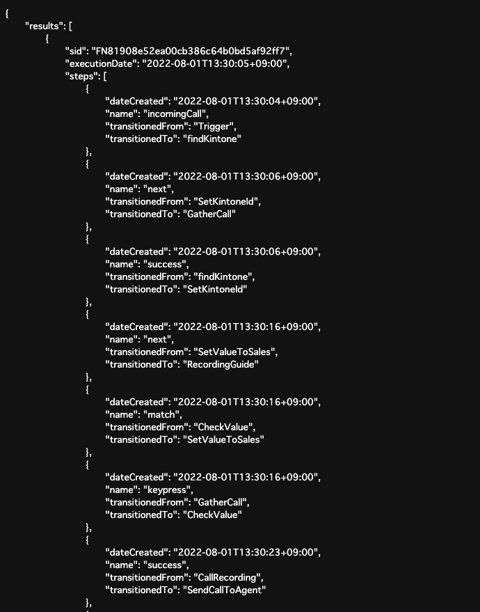

# Get Twilio Studio execution logs

This project is Functions for Twilio Studio execution logs.

## Setup

```sh
% git clone https://github.com/mobilebiz/studio-execution-logs.git
% cd studio-execution-logs
% cp .env.sample .env
```

## Edit .env

Update the copied .env file with an editor. The contents to be updated are as follows.

| Params      | Values                                         |
| :---------- | :--------------------------------------------- |
| ACCOUNT_SID | Twilio Account Sid (String starting with 'AC') |
| API_KEY     | Twilio API Key (String starting with 'SK')     |
| API_SECRET  | Twilio API Secret (Pair of API Key)            |
| FLOW_SID    | Studio Flow Sid (String starting with 'FW')    |
| PASSWORD    | (Option) If set, the `p` option is required.   |

## Local execute

```sh
% npm install
% npm start
```

Execute the following URL in your browser.

`http://localhost:3000/get-logs`

The log of the Studio flow executed today will be downloaded.  
If you want to download logs other than today's, you can use the following parameters.

| Params | Values               |
| :----- | :------------------- |
| y      | Year (ex. 2022)      |
| m      | Month (1-12)         |
| d      | Date of Month (1-31) |
| p      | Password (in `.env`) |

For example, if you want to download the logs for August 1, specify the following.

`http://localhost:3000/get-logs?y=2022&m=8&d=1`

## Deploy

```sh
% npm run deploy
```

When running on a server, the above parameters can be specified, but the results will not be downloaded and will be displayed on the screen.


